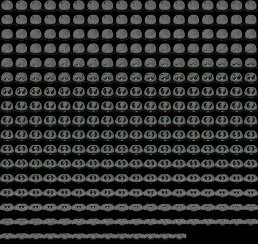

# lungmask

This nip2 workspace finds lungs in CT images.

### `convert.py` 

Convert the DICOMs in the covid19 dataset to nifti volumes. The covid19 dataset
is in:

    /vol/biomedic2/covid-19

Download the zips and run the converter to make a set of niftis.

### `find-lungs.ws` 

This [nip2](https://github.com/libvips/nip2) workspace finds the lungs. Sample
output (this image has been shrunk -- the real output is huge):

[](lung-mask.png)

The "algorithm" is very simple:

* mask off the bed
* convert the CT to g/cm3
* find voxels less than 0.8 g/cm3
* flood-fill from the volume edges to find and remove air
* flood again to find not-lung
* invert that mask and you'll have just the lungs with any interior cavities
  filled
* erode by three voxels
* for each slice, label disconnected regions and remove all but the two largest
  (this removes the trachea etc.)
* for each slice, the left-hand blob becomes the mask for that slice of the left
  lung mask

### Improvements

* It doesn't know about the diaphragm. I was working with PET scanners and 
  ignoring the area near the diaphragm was the easiest way to get rid of 
  motion.
* It's a 2D algorithm, so it doesn't see vertical connections. Reimplementing 
  in a library with proper 3D fills would fix this.
* It erodes before finding connected regions, so very thin parts of lung can
  become detached. Again, a proper 3D reimplementation would fix this.
* It becomes confused at the very top of the lungs (trachea becomes larger than
  a lung slice) and at the bottom (intestinal gas bubbles become larger than
  lung slices). Again, a 3D reimplementation should fix this.

### Docker container usage

For dicom to nifty file conversion, you can run the `run_container.py` script.

```
  -o OUTPUT, --output OUTPUT
                        Host path to output directory or filename
  -s SOURCE, --source SOURCE
                        Host path to dcm source volume directory or filename
```

Example use case:

```
python3 run_container.py --source ./source/ --output ./output/out.nii.gz
```
